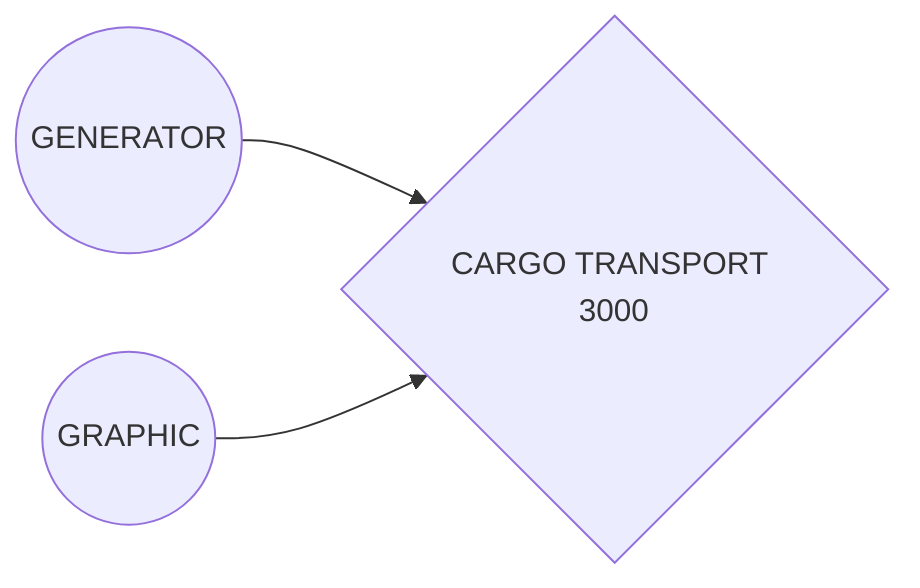

# Space Transport 3000

Hello. Enjoy my first game fully written in rust

# Requirements
Rust

# Compilation

cargo build

# Play

cargo run

or just run your binary from compilation

## Diags

Source code divided into two parts:
1.Reusable extension of SceneNode struct from kiss3d
	(When it will be a little bigger it wil be extracted fo separate crate)
2.Not reusable dedicated for game

